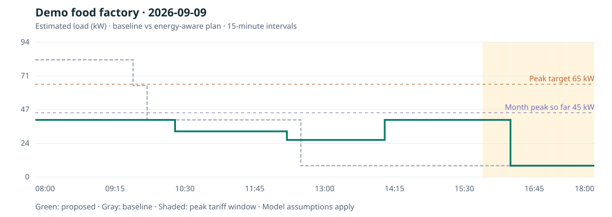

# BatchWatt V2

**Protect dispatch. Take control of peak demand.**

BatchWatt is an energy-aware production planner for small factories. It compares an earliest-start schedule with a proposed schedule that staggers machine loads while protecting dispatch deadlines. The app makes peak demand, electricity-cost effects and production blockers visible in one workspace.

## Version 1 is preserved

The complete original project, including its workbook and documentation, is preserved in the [`archive/batchwatt-v1` branch](https://github.com/raamnandhakumar-eng/batchwatt/tree/archive/batchwatt-v1), at commit `9f824fecd615cca292ea4a101e737263e6043dd6`. It is not overwritten by Version 2.

## The energy advantage

- **See the peak:** compare baseline and proposed 15-minute load profiles, background load, your demand target and the month’s peak so far.
- **Stagger production:** schedule each order on its assigned line using operating power, throughput, changeovers and shift capacity.
- **Understand the bill:** separate shift energy-charge changes from conditional monthly demand-charge savings. Timing shifts do not automatically save kWh.
- **Protect dispatch:** retain the baseline if the candidate drops work, worsens any scheduled order’s lateness or raises modeled combined cost/exposure.
- **Surface blockers:** allocate shared finished and packaging stock once per SKU; flag packaging shortages, insufficient shift capacity, late orders and target exceedance.

## Working product features

1. Editable orders, products, inventory, machines, shift times and energy tariffs.
2. One engine shared by the browser and Vercel API.
3. Paste validated WhatsApp-style order rows; unknown products and bad rows block import.
4. Review line timelines, dispatch actions and energy comparisons.
5. Save up to eight reviewed snapshots in this browser; restore or export them.
6. Download a load chart (SVG), dispatch plan (CSV), complete report (JSON), or copy the floor message.
7. Back up and restore factory inputs as JSON.

The new workspace processes inputs locally and stores drafts and reviewed snapshots on the same browser. It does not sync factory data to a cloud database. The optional stateless API computes a result from a supplied request but does not store it.

## Reproducible energy demonstration

The synthetic example has four orders and three production lines. It models an **82 kW baseline peak versus 40 kW proposed peak**, with the same production work and no late dispatches. These are software-example estimates, not new pilot measurements.



```bash
# Node.js 22+, no installation needed for these commands
node --test tests/*.test.js
node scripts/export-energy-plan.js samples/energy-demo.json output/energy-demo
```

The energy report writes a complete JSON result, input snapshot, dispatch CSV, SVG chart and floor message. Inputs follow `samples/energy-demo.json`.

## Vercel

- Framework preset: Other. Keep the repository root as the project root.
- `node scripts/build.js` copies only the V2 public assets to `dist/`; `vercel.json` publishes that directory. Company-specific pilot records and workbooks are excluded.
- `POST /api/generate-plan` accepts the structured V2 input and returns `schemaVersion: "2.0"`.
- Legacy text-input endpoints are retained in the V1 archive. The V2 planning API accepts the structured V2 contract.
- The V2 planner needs no API keys or database credentials.

See [energy model and product boundaries](docs/energy-model.md), [V1 planning behavior](docs/planning-behavior.md), and [version history](docs/version-history.md).

## Classic pilot workspace

The original classic workspace is preserved in `archive/batchwatt-v1`. The V2 deployment includes only application code and synthetic demonstration inputs.

The browser application now supports three simple input paths:

1. **Choose an existing pilot workspace**
   - RKG Ghee
   - PR Food Products

2. **Paste WhatsApp orders**
   - One order per line
   - Best format: `Customer | Product | Quantity | Due date | Priority | Stock` (stock reserved for this order)
   - Common message-style orders are also parsed

3. **Upload Excel or CSV data**
   - Order-only files are supported
   - Pilot Summary, Orders, Daily Metrics and Production Plan sheets are detected when available

The website then shows:

- orders and dispatches requiring attention;
- calculated shortages;
- a priority production sequence;
- planning-time, estimated energy and peak-load indicators when available;
- a copy-ready WhatsApp message for the floor team;
- an **Open in WhatsApp** action;
- downloadable JSON and CSV summaries, plus an SVG stock coverage chart.

## WhatsApp input and output

### Input

Orders can be pasted directly into the browser.

Example:

```text
Ravi Stores | Cow Ghee 1 L | 40 | tomorrow | high | stock 10
Anand Mart | Sambar Powder 200 g | 25 | Friday | urgent | stock 5
```

BatchWatt calculates shortages, ranks risk and creates a draft production sequence.

### Output

The app generates a message such as:

```text
BATCHWATT PRODUCTION PLAN
Orders reviewed: 2
Orders at risk: 2

1. Produce the urgent Sambar Powder shortage first.
2. Produce the Cow Ghee shortage and reserve material.

Supervisor checks:
- Confirm raw material and packaging.
- Confirm line availability.
- Approve the sequence before release.
```

The output can be copied or opened in WhatsApp.

### Current integration boundary

This is **browser-based WhatsApp intake and output**, not a direct Meta WhatsApp Business API integration.

A live WhatsApp deployment would still require:

- a verified WhatsApp Business number;
- Meta Cloud API credentials;
- an inbound webhook;
- approved outbound message templates where required;
- a production database and user authentication;
- monitoring, retries and audit logs.

## Privacy

Uploaded files and pasted WhatsApp messages are processed in the browser. Raw inputs are not sent to a BatchWatt server or committed to this public repository.

Only the calculated workspace summary is stored in the current browser's local storage so the user can reopen it on the same device.

## Pilot records

| Pilot | Period | Cycles | Orders | SKUs | Lines / stages | Planning-time reduction | Estimated energy reduction | Peak-load reduction | Operator rating |
|---|---|---:|---:|---:|---:|---:|---:|---:|---:|
| RKG Ghee | Jul 7–20, 2026 | 10 | 32 | 6 | 2 | 64.2% | 8.8% | 11.7% | 4.34 / 5 |
| PR Food Products | Jul 14–25, 2026 | 9 | 41 | 8 | 3 | 62.3% | 6.7% | 9.0% | 4.26 / 5 |

Across the two supplied pilot datasets, BatchWatt records **19 planning cycles**, **73 orders**, **16 orders or dispatches flagged at risk**, and **14 production-sequencing changes**.

Pilot documentation:

- [`docs/pilots/rkg-ghee-pilot.md`](docs/pilots/rkg-ghee-pilot.md)
- [`docs/pilots/pr-food-products-pilot.md`](docs/pilots/pr-food-products-pilot.md)
- [`docs/pilots/pilot-methodology.md`](docs/pilots/pilot-methodology.md)

## Claim boundary

The safe public claim is:

> BatchWatt contains operational pilot records for RKG Ghee and PR Food Products using order, stock, production and energy data. Results shown are calculated from the supplied pilot workbook; external verification and publication permissions are tracked separately.

Do not describe the pilot results as independently verified, customer-approved or a fully integrated production deployment until the supporting evidence is attached and approved.

## Local development

```bash
npm install
npm test
npm run demo
npm run dev
```

The website is static and Vercel-compatible. Excel parsing is loaded client-side with SheetJS.
