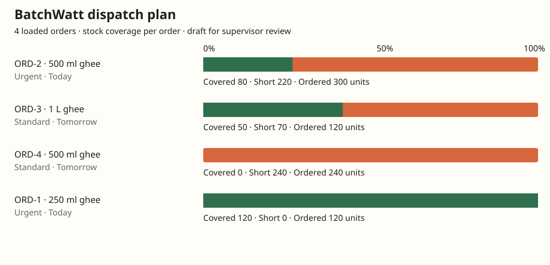

# BatchWatt

**Simple dispatch-first production planning for small food factories.**

BatchWatt turns orders, stock and production information into a clear daily answer: **what should the factory produce next?**

## Project improvements

The planner now reserves finished stock **and packaging once per SKU**, flags packaging shortages, and explains each dispatch decision. An order can be ready from stock, need production, or need packaging resolved first.

The browser now includes:

- a downloadable **stock coverage chart** for every loaded order;
- a separate chart for recorded planning, estimated energy and peak-load changes;
- complete CSV and WhatsApp outputs without row limits;
- row-level validation and clear warnings for missing stock or uncertain dates;
- a distinction between loaded pilot examples and whole-pilot totals;
- missing metrics shown as unavailable, including when a baseline has no after measurement.

**Example output from the repository's synthetic sample input:**



This chart is a reproducible software demonstration, not a new pilot result. Bars use each order's own unit; unlike quantities are not summed together.

## Run a reproducible planning example

Requires Node.js 22 or newer. The tests and local report command use only Node's built-in modules; no credentials or package installation are required.

```bash
node --test tests/*.test.js
node scripts/export-plan.js samples/sample_plan_payload.json output/demo
```

The report command writes `plan.json`, `dispatch-plan.csv`, `stock-coverage.svg`, and `floor-message.txt`. To use your own data:

```bash
node scripts/export-plan.js path/to/input.json output/my-factory
```

Use the sample JSON's `whatsappText`, `stockCsv`, and `billText` fields. The output folder is ignored by Git to keep local planning records out of commits. The browser and API input contracts differ: see [planning behavior and limitations](docs/planning-behavior.md).

## Operational website

**Live app:** https://batchwatt.vercel.app/

The browser application now supports three simple input paths:

1. **Choose an existing pilot workspace**
   - RKG Ghee
   - PR Food Products

2. **Paste WhatsApp orders**
   - One order per line
   - Best format: `Customer | Product | Quantity | Due date | Priority | Stock` (stock reserved for this order)
   - Common message-style orders are also parsed

3. **Upload Excel or CSV data**
   - Order-only files are supported
   - Pilot Summary, Orders, Daily Metrics and Production Plan sheets are detected when available

The website then shows:

- orders and dispatches requiring attention;
- calculated shortages;
- a priority production sequence;
- planning-time, estimated energy and peak-load indicators when available;
- a copy-ready WhatsApp message for the floor team;
- an **Open in WhatsApp** action;
- downloadable JSON and CSV summaries, plus an SVG stock coverage chart.

## WhatsApp input and output

### Input

Orders can be pasted directly into the browser.

Example:

```text
Ravi Stores | Cow Ghee 1 L | 40 | tomorrow | high | stock 10
Anand Mart | Sambar Powder 200 g | 25 | Friday | urgent | stock 5
```

BatchWatt calculates shortages, ranks risk and creates a draft production sequence.

### Output

The app generates a message such as:

```text
BATCHWATT PRODUCTION PLAN
Orders reviewed: 2
Orders at risk: 2

1. Produce the urgent Sambar Powder shortage first.
2. Produce the Cow Ghee shortage and reserve material.

Supervisor checks:
- Confirm raw material and packaging.
- Confirm line availability.
- Approve the sequence before release.
```

The output can be copied or opened in WhatsApp.

### Current integration boundary

This is **browser-based WhatsApp intake and output**, not a direct Meta WhatsApp Business API integration.

A live WhatsApp deployment would still require:

- a verified WhatsApp Business number;
- Meta Cloud API credentials;
- an inbound webhook;
- approved outbound message templates where required;
- a production database and user authentication;
- monitoring, retries and audit logs.

## Privacy

Uploaded files and pasted WhatsApp messages are processed in the browser. Raw inputs are not sent to a BatchWatt server or committed to this public repository.

Only the calculated workspace summary is stored in the current browser's local storage so the user can reopen it on the same device.

## Pilot records

| Pilot | Period | Cycles | Orders | SKUs | Lines / stages | Planning-time reduction | Estimated energy reduction | Peak-load reduction | Operator rating |
|---|---|---:|---:|---:|---:|---:|---:|---:|---:|
| RKG Ghee | Jul 7–20, 2026 | 10 | 32 | 6 | 2 | 64.2% | 8.8% | 11.7% | 4.34 / 5 |
| PR Food Products | Jul 14–25, 2026 | 9 | 41 | 8 | 3 | 62.3% | 6.7% | 9.0% | 4.26 / 5 |

Across the two supplied pilot datasets, BatchWatt records **19 planning cycles**, **73 orders**, **16 orders or dispatches flagged at risk**, and **14 production-sequencing changes**.

Pilot documentation:

- [`docs/pilots/rkg-ghee-pilot.md`](docs/pilots/rkg-ghee-pilot.md)
- [`docs/pilots/pr-food-products-pilot.md`](docs/pilots/pr-food-products-pilot.md)
- [`docs/pilots/pilot-methodology.md`](docs/pilots/pilot-methodology.md)

## Claim boundary

The safe public claim is:

> BatchWatt contains operational pilot records for RKG Ghee and PR Food Products using order, stock, production and energy data. Results shown are calculated from the supplied pilot workbook; external verification and publication permissions are tracked separately.

Do not describe the pilot results as independently verified, customer-approved or a fully integrated production deployment until the supporting evidence is attached and approved.

## Local development

```bash
npm install
npm test
npm run demo
npm run dev
```

The website is static and Vercel-compatible. Excel parsing is loaded client-side with SheetJS.
